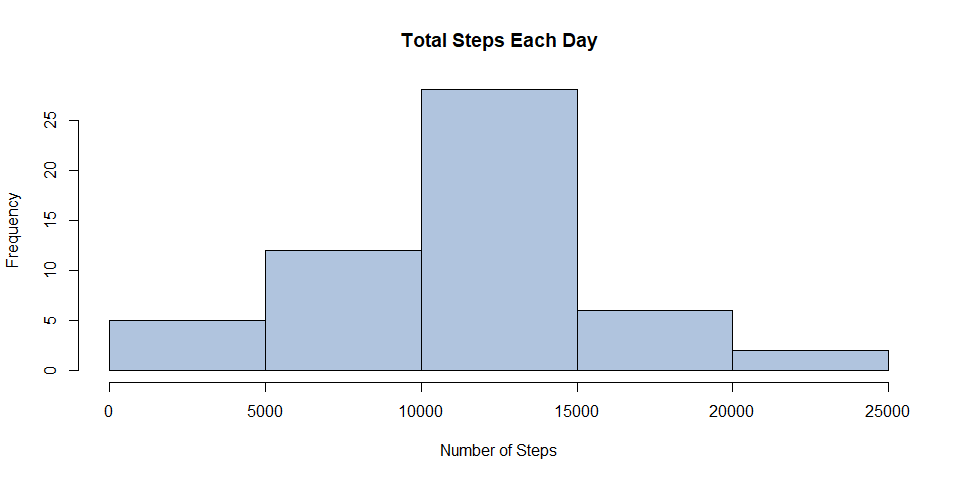
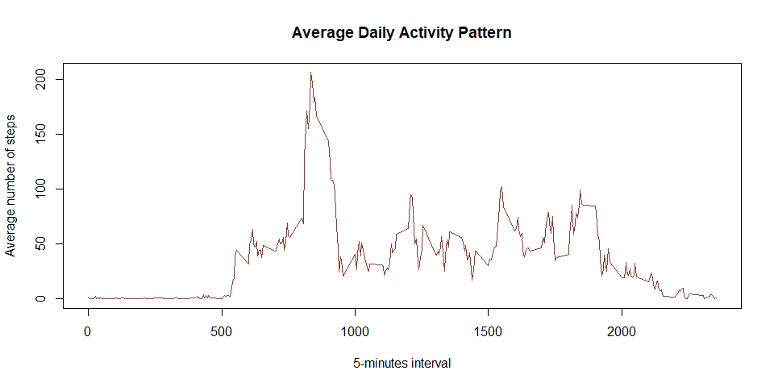
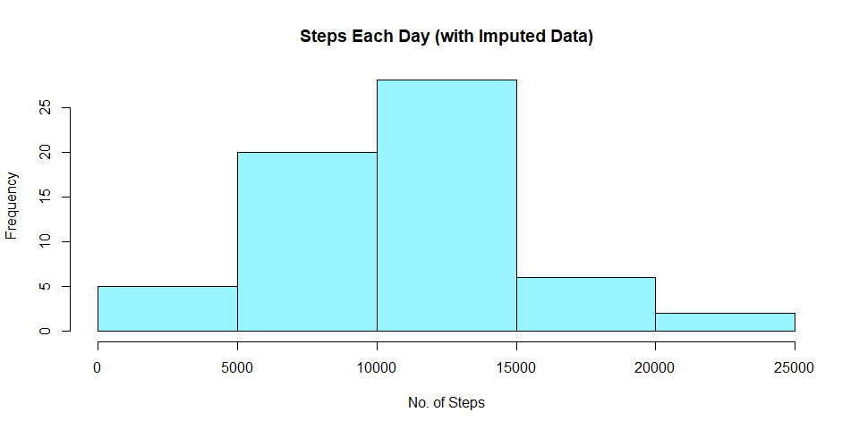
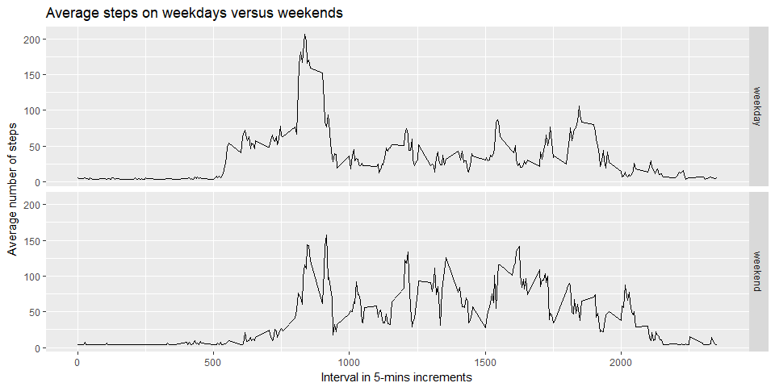

Reproducible Research Course Assignment 1
================
A. Swarup
March 16, 2018

## Coursera Reproducible Research Course Assignment 1 - AS

This is my submission for Reproducible Research Course Project 1. To
read more information view the
[ReadMe](https://github.com/ASwarup1/RepData_PeerAssessment1/blob/master/README.md)

### Prepare for analyses

``` r
# libraries
library(ggplot2)
```

### Loading and preprocessing the data

    Show any code that is needed to
        1. Load the data (i.e. read.csv())
        2. Process/transform the data (if necessary) into a format suitable for your analysis

``` r
rm(list=ls())
setwd("C:/Users/ASwar/ReprProj/RepData_PeerAssessment1")

# Download, unzip, and load data into data frame data
destfile1="./repdata_data_activity.zip"
destfile2="./activity.csv"

fileURL <- "http://d396qusza40orc.cloudfront.net/repdata%2Fdata%2Factivity.zip"
temp <- tempfile("activity", tmpdir="C:/Users/ASwar/ReprProj", fileext="csv")

if(file.exists(destfile2)) {
    data <- read.csv("./activity.csv")
} else {
        if(!file.exists(destfile1)) {
           download.file(fileURL, temp, method="auto")
           unzip(temp)
           unlink(temp)
        } else {
          unzip(destfile1)
        }
    data <- read.csv("./activity.csv")
}
```

``` r
# head(data)
# some information about the variables
str(data)
```

    ## 'data.frame':    17568 obs. of  3 variables:
    ##  $ steps   : int  NA NA NA NA NA NA NA NA NA NA ...
    ##  $ date    : Factor w/ 61 levels "2012-10-01","2012-10-02",..: 1 1 1 1 1 1 1 1 1 1 ...
    ##  $ interval: int  0 5 10 15 20 25 30 35 40 45 ...

As we can see, the variables included in this dataset are: **1. steps**:
Number of steps taking in a 5-minute interval (missing values are coded
as NA) **2. date**: The date on which the measurement was taken in
YYYY-MM-DD format **3. interval**: Identifier for the 5-minute interval
in which measurement was
    taken

### Mean total number of steps taken per day

    For this part of the assignment, you can ignore the missing values in the dataset.
        1. Calculate the total number of steps taken per day
        2. Make a histogram of the total number of steps taken each day
        3. Calculate and report the mean and median total number of steps taken per day

**1. Number of steps per day**

``` r
# Calculate total number of steps per day - ignore NA's
stepsPerDay <- aggregate(steps ~ date, data, sum, na.rm=TRUE)
head(stepsPerDay)
```

    ##         date steps
    ## 1 2012-10-02   126
    ## 2 2012-10-03 11352
    ## 3 2012-10-04 12116
    ## 4 2012-10-05 13294
    ## 5 2012-10-06 15420
    ## 6 2012-10-07 11015

**2. Histogram of the total number of steps taken each
day**

``` r
hist(stepsPerDay$steps, xlab="Number of Steps", main="Total Steps Each Day", col="lightsteelblue")
```

<!-- -->

**3. Mean and median of total number of steps taken per
day**

``` r
# Calculate and report the mean and median of the total number of steps per day
meanStepsPerDay <- mean(stepsPerDay$steps)
medianStepsPerDay <- median(stepsPerDay$steps)

meanStepsPerDay
```

    ## [1] 10766.19

``` r
medianStepsPerDay
```

    ## [1] 10765

### Average daily activity pattern

    1. Make a time series plot (i.e. type = "l") of the 5-minute interval (x-axis) and the average number of steps taken, averaged across all days (y-axis)
    2. Which 5-minute interval, on average across all the days in the dataset, contains the maximum no. of steps?

**1. Time series plot of the 5 minute interval (x-axis) and average
number of steps taken (y-axis), averaged across all days**

``` r
# Calculate average steps for each interval for all days
stepsByInterval <- aggregate(steps ~ interval, data, mean, na.rm=TRUE)
head(stepsByInterval)
```

    ##   interval     steps
    ## 1        0 1.7169811
    ## 2        5 0.3396226
    ## 3       10 0.1320755
    ## 4       15 0.1509434
    ## 5       20 0.0754717
    ## 6       25 2.0943396

``` r
# Plot average no. of steps per day by interval
plot(stepsByInterval$interval, stepsByInterval$steps, type = "l",
    xlab="5-minutes interval",
    ylab="Average number of steps",
#   main="Average Number of Steps per Day by Interval",
    main="Average Daily Activity Pattern",
    col="coral4")
```

<!-- --> **2. 5-minute
interval (on average across all the days) with the maximum number of
steps**

``` r
# Which 5 minute interval contains the maximum number of steps?
maxStepsInterval <- stepsByInterval[which.max(stepsByInterval$steps),1]
maxStepsInterval
```

    ## [1] 835

### Imputing missing values

    Note that there are a number of days/intervals where there are missing values (coded as NA).  The  presence of missing days may introduce bias into some calculations or summaries of the data.
     1. Calculate & report the total no. of missing values in the dataset (i.e. the total number of rows with NAs).
     2. Devise a strategy for filling in all of the missing values in the dataset. The strategy does not need to be sophisticated. E.g., you could use the mean/median for that day, or the mean for that 5-minute interval, etc.
     3. Create a new dataset that is equal to the original dataset but with the missing data filled in.
     4. Make a histogram of the total number of steps taken each day and Calculate and report the mean and median  total number of steps taken per day. Do these values differ from the estimates from the 1st part of the assignment? What is the impact of imputing missing data on the estimates of the total daily number of steps?

**1. Total number of missing values in the dataset**

``` r
# No. of rows with the missing values in the dataset
numMissing <- length(which(is.na(data$steps)))
# No. of missing values are:
numMissing
```

    ## [1] 2304

**2. Replace missing values** Assuming the person walked only 80% of
average during times for which the data is missing; to get the dataset
with imputed values, we substitute NA values with a value = 0.8 times
the average of all values in the dataset.

``` r
# New dataset data2 has steps with NA replaced with imputed values
data2 <- transform(data, steps = ifelse(is.na(data$steps), 0.8*mean(data$steps, na.rm=TRUE), data$steps))
```

**3. New dataset that is equal to the original dataset but with the
missing data filled in** First ten rows of the new dataset are shown
below.

``` r
# see first 10 values of the new dataset
head(data2, n=10)
```

    ##       steps       date interval
    ## 1  29.90608 2012-10-01        0
    ## 2  29.90608 2012-10-01        5
    ## 3  29.90608 2012-10-01       10
    ## 4  29.90608 2012-10-01       15
    ## 5  29.90608 2012-10-01       20
    ## 6  29.90608 2012-10-01       25
    ## 7  29.90608 2012-10-01       30
    ## 8  29.90608 2012-10-01       35
    ## 9  29.90608 2012-10-01       40
    ## 10 29.90608 2012-10-01       45

**4A. Histogram of the total number of steps taken each day with missing
data filled in**

``` r
# Prepare data
stepsPerDay2 <- aggregate(steps ~ date, data2, sum)
# head(stepsPerDay2)
# Draw the histogram
hist(stepsPerDay2$steps, xlab="No. of Steps", main="Steps Each Day (with Imputed Data)", col="cadetblue1")
```

<!-- --> **4B.
Calculate and report the mean and median total number of steps taken per
day. Do these values differ from the estimates from the first part of
the assignment? What is the impact of imputing missing data on the
estimates of the total daily number of steps?**

``` r
meanStepsPerDay2 <- mean(stepsPerDay2$steps)
medianStepsPerDay2 <- median(stepsPerDay2$steps)

meanStepsPerDay2
```

    ## [1] 10483.8

``` r
medianStepsPerDay2
```

    ## [1] 10395

*Imputing missing data have some impact on the mean and the median of
the total daily number of steps. By examining the two histograms we can
see that the only bin that is changed is the interval between 5000 and
10000 steps, grown from a frequency of 12 to a frequency of 20.
Different strategies for replace missing values could show different
results.*

### Are there differences in activity patterns between weekdays and weekends?

    Here the weekdays() function may be of help. For this part, use the dataset with the filled-in missing values.
        1. Create a new factor variable in the dataset with two levels - "weekday" and "weekend" indicating whether a given date is a weekday or weekend day.
        2. Make a panel plot containing a time series plot (i.e. type = "l") of the 5-minute interval (x-axis) and the average number of steps taken, averaged across all weekday days or weekend days (y-axis).

**1. Create a new factor variable in the dataset with two levels -
“weekday” and “weekend” indicating whether a given date is a weekday
or weekend day.** *dateType* is the new column indicating if the day is
a weekday day or a weekend day: the first ten values of the new table
are shown
below

``` r
# A factor variable - dateType: whether a weekday or a weekend (Saturday or Sunday)
data2$dateType <- ifelse(as.POSIXlt(data2$date)$wday %in% c(0,6), "weekend", "weekday")
# see first 10 values
head(data2$dateType, n=10)
```

    ##  [1] "weekday" "weekday" "weekday" "weekday" "weekday" "weekday" "weekday"
    ##  [8] "weekday" "weekday" "weekday"

**2. Two time series plots of the 5-minute interval (x) and the average
number of steps (y) taken averaged across weekday days or weekend
days.**

``` r
# Panel plot containing time series plots for weekdays and weekends
averaged_data2 <- aggregate(steps ~ interval + dateType, data=data2, mean)
ggplot(averaged_data2, aes(interval, steps)) +
   geom_line() +
   facet_grid(dateType ~ .)+
   ggtitle("Average steps on weekdays versus weekends") +
   xlab("Interval in 5-mins increments") +
   ylab("Average number of steps")
```

<!-- --> *We notice
reduced activity in the interval range 500-900 during the weekends.*
